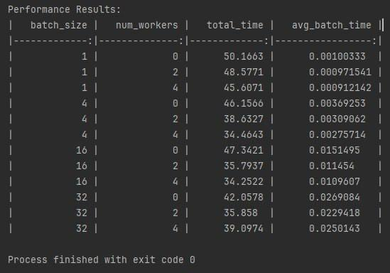
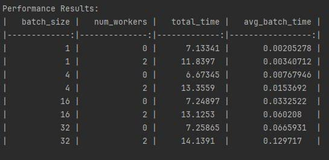
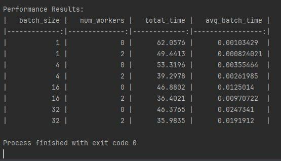

# Лабораторная работа №1 

Выполнил: Шайдуров Даниил Сергеевич

Тема: Загрузка и предобработка данных в PyTorch

Цель работы:
Освоить методы загрузки и обработки данных в PyTorch, включая создание пайплайна для работы с изображениями, применение аугментаций и оценку производительности загрузки.

## Dataset CIFAR10
Результаты замеров времени обработки файлов

## Dataset Plants

## Dataset MNIST

## На основе проведенных замеров можно сделать следующие выводы:

Влияние batch_size:
Увеличение batch_size в целом снижает общее время обработки (total_time), но увеличивает среднее время на батч (avg_batch_time).
Оптимальный batch_size зависит от задачи: для быстрой итерации подходят небольшие батчи (4–16), а для максимальной пропускной способности – крупные (32).

Влияние num_workers:
Использование нескольких воркеров (num_workers=2 или 4) ускоряет загрузку данных, особенно при batch_size >=4.
Однако при малых batch_size (1–4) многопоточность может давать оверхед (увеличение total_time в некоторых тестах).

